# Image Upload To Editor Flowchart

## Overview

This document contains a Mermaid visual flowchart showing the exact flow from image upload through the processing pipeline and into the editor.

## Mermaid Flowchart

```mermaid
flowchart TD
    subgraph U1[Upload and Scene Creation]
        A[User uploads image]
        B[Frontend requests signed upload URL]
        C[Local API creates asset record]
        D[Frontend uploads original image to object storage]
        E[Frontend finalizes asset]
        F[Local API creates normalize job]
        G[Normalization worker creates normalized image preview thumbnail]
        H[Artifacts stored in object storage]
        I[Local API creates scene]
        J[Editor loads scene and preview image]
        A --> B --> C --> D --> E --> F --> G --> H --> I --> J
    end

    subgraph S1[Segmentation Flow]
        K[User enters Select Elements mode]
        L[User adds points or box prompts]
        M[Frontend sends segmentation request to local API]
        N[Local API creates segmentation job]
        O[Local API generates signed URLs]
        P[Local API calls Runpod segmentation endpoint]
        Q[Runpod downloads normalized image]
        R[Runpod SAM3 generates candidate masks]
        S[Runpod uploads mask artifacts]
        T[Runpod returns mask metadata]
        U[Local API stores artifacts and updates job]
        V[Frontend displays candidate masks]
        W{User accepts mask?}
        K --> L --> M --> N --> O --> P --> Q --> R --> S --> T --> U --> V --> W
    end

    subgraph E1[Layer Extraction]
        X[Local API creates extract layer job]
        Y[Layer extraction uses full-resolution image]
        Z[System creates mask RGBA crop bbox thumbnail]
        AA[Background hole region or plate generated]
        AB[Layer registered in scene graph]
        X --> Y --> Z --> AA --> AB
    end

    subgraph R1[Refinement Suggestion]
        AC[Quality analyzer checks layer edges]
        AD{Refinement suggested?}
        AE[Layer marked Refine suggested]
        AF[Layer marked clean]
        AG[Editor shows suggestion state]
        AC --> AD
        AD -->|Yes| AE --> AG
        AD -->|No| AF --> AG
    end

    subgraph D1[Depth Pipeline]
        AH[Local API creates depth job]
        AI[Local API generates signed URLs]
        AJ[Local API calls Runpod depth endpoint]
        AK[Runpod downloads normalized image]
        AL[Runpod Depth Anything 3 generates depth artifacts]
        AM[Runpod uploads depth outputs]
        AN[Runpod returns depth metadata]
        AO[Local API stores depth artifacts]
        AP[System computes per-layer depth metrics]
        AQ[Scene graph updated with z-order and parallax defaults]
        AH --> AI --> AJ --> AK --> AL --> AM --> AN --> AO --> AP --> AQ
    end

    subgraph M1[Optional Matting]
        AR{User toggles Refine edges?}
        AS[Keep base RGBA active]
        AT[Local API creates matting job]
        AU[Local API calls Runpod matting endpoint]
        AV[Runpod downloads crop and mask]
        AW[Runpod refines alpha and RGBA]
        AX[Runpod uploads refined artifacts]
        AY[Local API stores refined artifacts]
        AZ[Scene graph switches active asset]
        AR -->|No| AS
        AR -->|Yes| AT --> AU --> AV --> AW --> AX --> AY --> AZ
    end

    subgraph Q1[Optional Qwen Enhancement]
        BA{User invokes Enhance layer?}
        BB[Continue with current active assets]
        BC[Local API creates layer refine job]
        BD[Local API calls Runpod refine-layer endpoint]
        BE[Runpod downloads crop and optional mask]
        BF[Runpod Qwen refinement runs]
        BG[Runpod uploads enhanced RGBA]
        BH[Local API stores enhanced layer version]
        BI[Editor allows compare and activate enhanced version]
        BA -->|No| BB
        BA -->|Yes| BC --> BD --> BE --> BF --> BG --> BH --> BI
    end

    subgraph P1[Editor and Preview]
        BJ[Editor loads scene graph layers]
        BK[PixiJS runtime creates layer sprites]
        BL[Inspector shows transforms depth visibility refinement state]
        BM[User edits layers]
        BN[Scene graph patched and versioned]
        BO[Scroll preview computes parallax motion]
        BP[Editor displays final parallax composition]
        BJ --> BK --> BL --> BM --> BN --> BO --> BP
    end

    J --> K
    W -->|Yes| X
    W -->|No retry| L
    AB --> AC
    AB --> AH
    AG --> AR
    AQ --> BJ
    AS --> BA
    AZ --> BA
    BB --> BJ
    BI --> BJ
```

## Suggested Efficiency Improvement

- Add segmentation embedding caching for repeated prompt refinement on the same image.
- Add deterministic depth caching keyed by source checksum and model version.
- Keep matting and Qwen enhancement opt-in so the main path stays fast.
